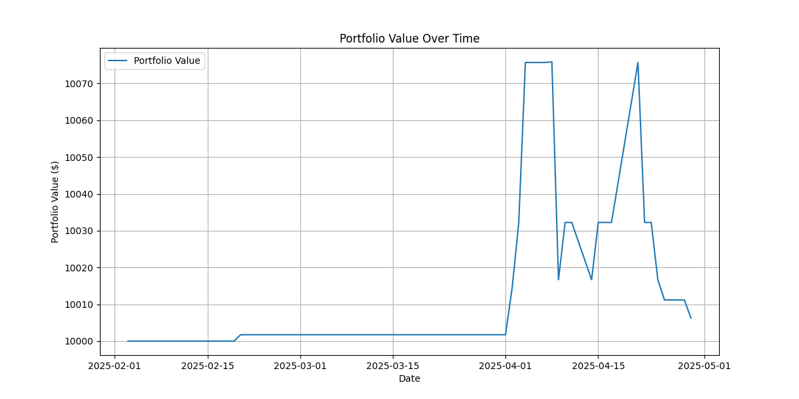

# RL Options Trading Bot

A Deep Q-Network (DQN) reinforcement learning agent for US stock options trading, featuring a custom OpenAI Gym environment, backtesting, and a Streamlit dashboard for monitoring and paper trading.

---

## 🚀 Running Instructions

1. **Clone the repository**
2. **Set your API keys** in `utils/config.py`
3. **Install dependencies**
   ```bash
   pip install -r requirements.txt
   ```
4. **Train the RL model**
   ```bash
   python rl_model/train_rl_model.py
   ```
5. **Run the Streamlit app**
   ```bash
   streamlit run app/app.py
   ```
6. **If you'd like to see backtest results run the file called "backtest_dynamic_option_chain.ipynb**

---

## 🧠 Model Type

- **Deep Q-Network (DQN)**
- Implemented with Stable Baselines3
- Custom OpenAI Gym environment for options trading

---

## 🏆 Reward Function

- **+1** for each successful sell action
- **0** otherwise  
  _(See `OptionsTradingEnv.step` in `rl_model/trading_env.py`)_

---

## Model results


